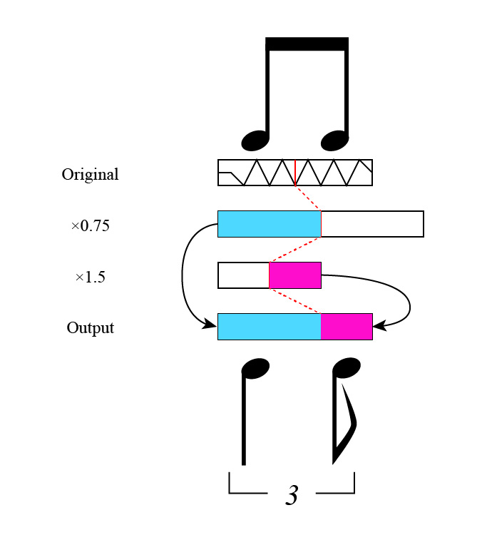

# AudioSwingnizer
Python program to convert audio to swing rhythm for remix or something

## How to use
### Preliminary preparations
Create 1.5 times and 0.75 times the speed of an original sound source (Please use 3rd party software, e.g. DAW). The original wav file should be synchronized to the tempo from beginning to end.

### Run program
$ python swingnizer.py <.wav file 1.5 times the speed> <.wav file 0.75 times the speed> <tempo> <length(second)> <output wav file>

#### Example
$ python swingnizer.py sample/fast.wav sample/slow.wav 170 10 sample/out.wav

This program converts two eighth notes to a quarter triplet note and an eighth triplet note. If you want to convert two 16th notes to an eighth triplet note and a 16th triplet note, double the tempo of the input.

## What the program does

Cut and paste the two sound source and mix the borders

## License
[MIT](https://github.com/cln515/AudioSwingnizer/blob/master/LICENSE)